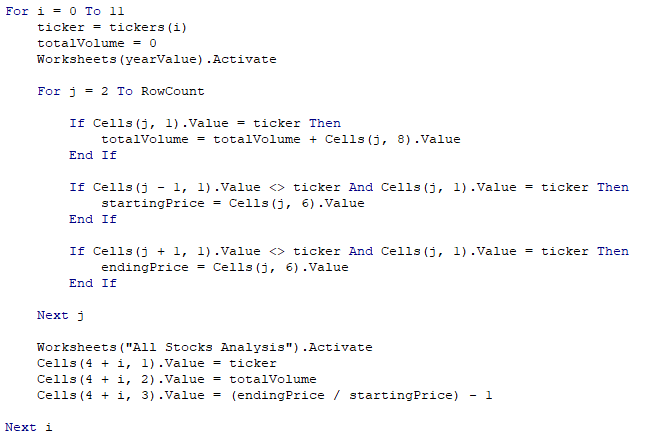
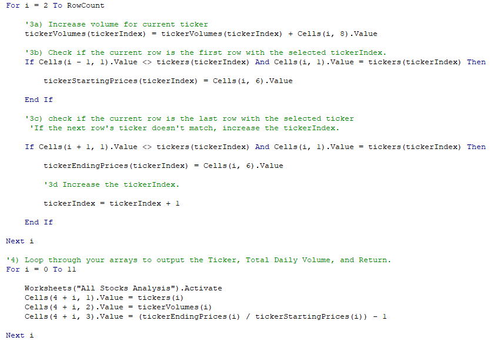
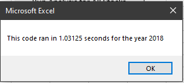
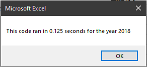

# Stock Analysis using Visual Basic

## Overview
Our client has given us his approval of the workbook that we prepared so he is looking to expand the dataset to do more research. Now we must optimize the macros we created in order to decrease the amount of time the program will take to create the analysis even when expanding the dataset. We will refactor the macros to achieve this by reducing the steps taken and using less memory to create efficiency. 

## Results
### Code

The original code is functional but uses nested loops which reiterates for a total of about 36000 times. This really increases the time the program needs to run.

The new code separates the printing and the data organization to two loops. This reduces the loops in the macro to about 3020 which cuts down on the time need to complete.
### Time

Comparing the times of the old and new code, we can see a 800% percent decrease in time needed to complete the process and it still outputs the same data.

## Summary

### Refactoring

Refactoring is a skill that can increase the efficiency of old code and help newcomers to the program increase their understanding of the architecture of the overall program. Some drawbacks that may come from a business view of the opitmization as it takes time and if the person working on the code hasn't worked on it before it will take even longer. Process itself also doesn't add anything to code so it may be seen as a net negative.

### Conclusions

The new code that we created for our client has suceeded in both retaining functionality and increasing it's efficiency. In refactoring the code, we have also made the code more readable and less complex so new additions can be added when needed. That being said, we have also added to the overall time that we have spent on the code and refactoring would not be recommended if when have not confirmed functionality first. There was also the chance of causing more bugs by changing the code. That being said, we have made a more efficient and clean final product for our client.
